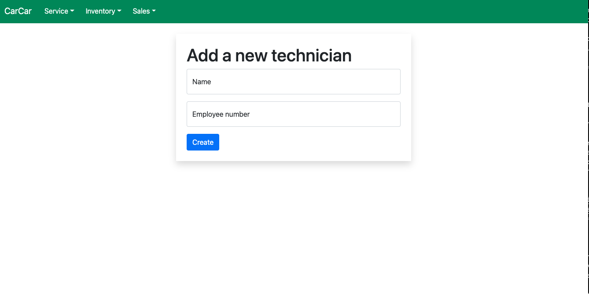
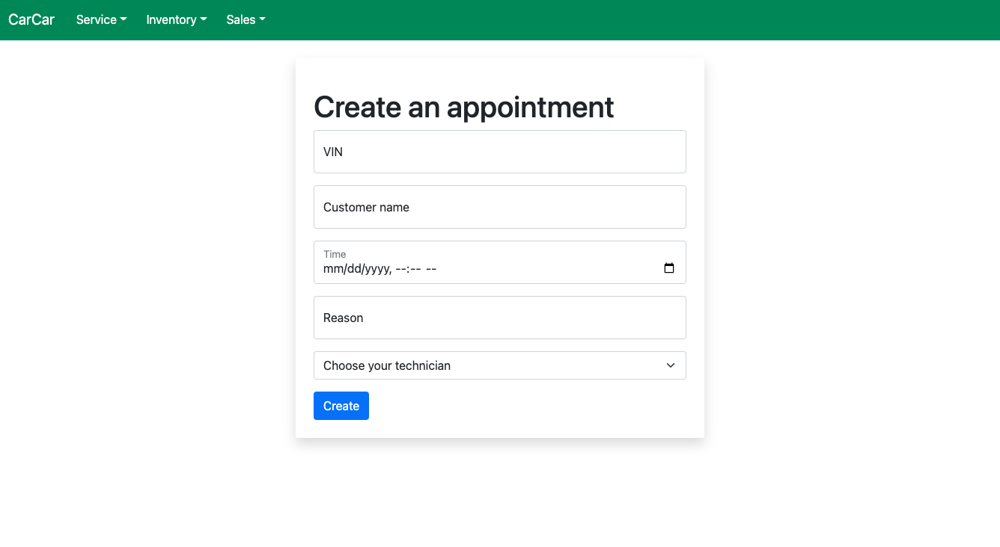
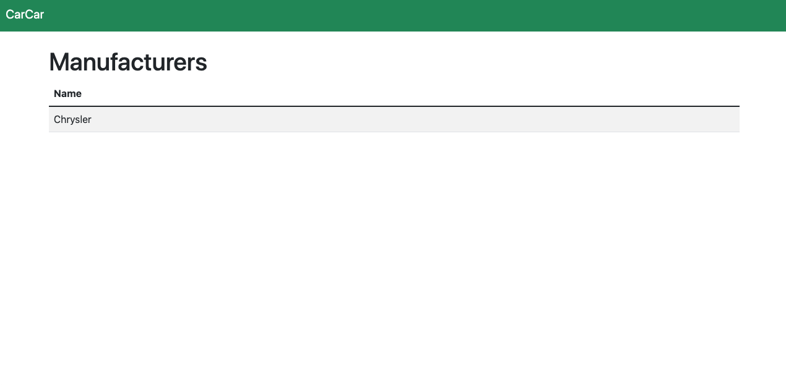
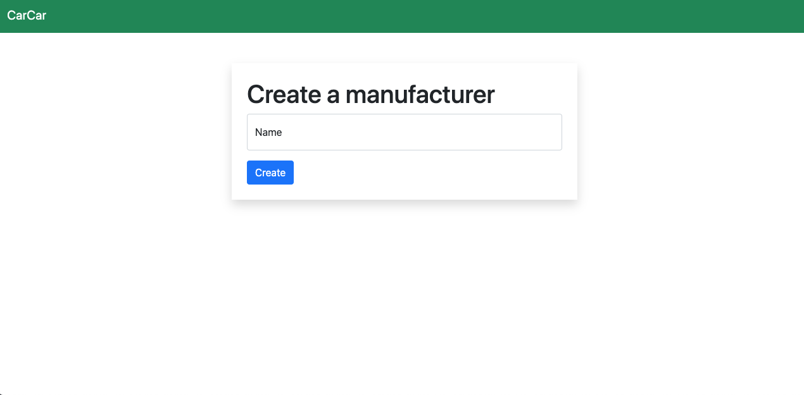
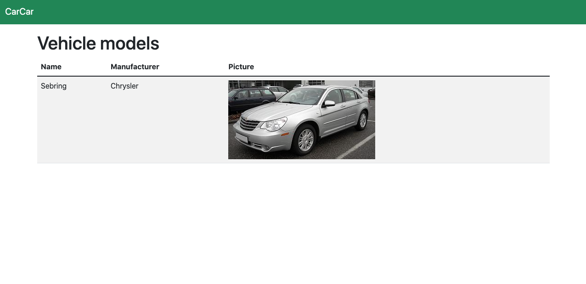
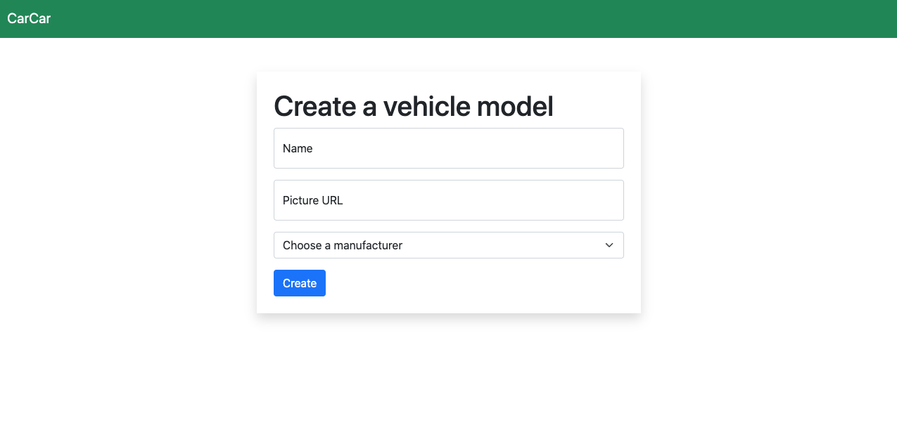
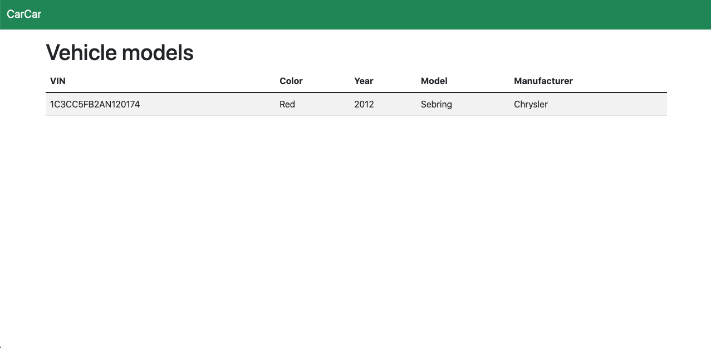
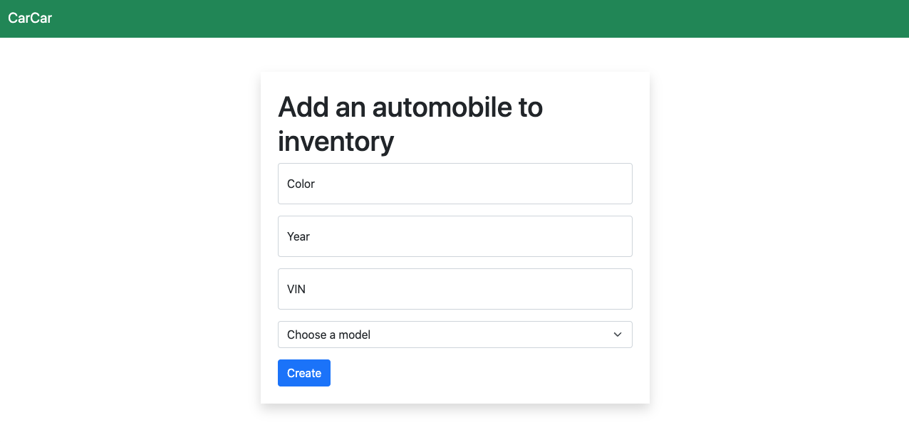

# CarCar 🚗

**Team 👩‍💻**

* Rachel Johnson - Sales microservice
* Wenqi Jin - Service microservice

## Features ✨✨✨
**CarCar provides the following features:**
- Show list of appointments
- Create new appointment
- Show past services for a vehicle
- Show list of technicians
- Add new technician
- Show list of manufacturers
- Add new manufacturer
- Show list of car models
- Add new car model
- Show list of automobiles
- Add new automobiles
- Add new customers
- Add new sales representatives
- Add sale transaction records
- View all sale transactions
- View sale transactions by sale representative

CarCar is an app comprised of three microservices: Inventory, Sales and Services. The aggregate root of CarCar is Inventory as the bounded contexts of Sales and Services is based on data in the Inventory microservice.

The microservices communicate via a poller. The sales microservice polls for value objects based on the automobile model in Inventory.

The inventory API runs on port 8100.
URLS to access the inventory API:
- http://localhost:8100/api/manufacturers/
- http://localhost:8100/api/models/
- http://localhost:8100/api/automobiles/


## Getting Started 🏁
You can get started with Carcar by setting up a local development environment.

## Development Environment(Local)
### System Requirements
- Docker
- Git

### Initializing all the services
To initialize all the services on a local development environment, including running a docker image for the DB and seeding the DB with the codes below.
```
docker volume create beta-data
docker-compose build
docker-compose up
```

## Design
"Sales", "Services", and "Inventory" are each in their own separate microservices.

```insert diagram here```

# API Endpoints
## Service microservice
The Service microservice keeps track of service appointments for automobiles and their owners.
The service API runs on port 8080.

### Functionality 📕
**Enter a technician:**
- User can use a form to enter an automobitive technician's name and employee number. When the form is submitted, the automotive technician is created in the application. A success-message-alert will show in the window.
- User can access the function from http://localhost:8080/technicians/new/ in the application.
- From Insomnia, user can access the technician endpoints at the following URLs.
1. List technicians	```GET```	http://localhost:8080/api/technicians/
2. Create a technician	```POST```	http://localhost:8080/api/technicians/



**Enter a service appointment:**
- User can enter the VIN of the vehicle, the name of the owner, the date and time of the appointment, the assigned technician, and a reason for visit. When the form is submitted, the service appointment is created and saved in the application. A success-message-alert will show in the window.
- User can access the function from http://localhost:8080/service/new/ in the application.
- From Insomnia, user can access the appointments endpoints at the following URLs.
1. Create an appointment	POST	http://localhost:8080/api/appointments/



**List of appointments:**
- User can see a list of scheduled appointments that contain the details collected in the form: VIN, customer name, date and time of the appointment, the assigned technician's name, and the reason for the service.
- If the VIN is for an automobile that was at one time in the inventory, then the automobile was purchased from the dealership. The list of scheduled appointments in the backend will show that the automobile can get "VIP treatment".
- Each appointment in the list of appointments has a button that allows the user to cancel the appointment, or to show that the service appointment has been finished. When a service appointment is canceled or finished, it should no longer show up in the list of appointments.
- User can access the function from http://localhost:3000/service/ in the application.
From Insomnia and your browser, user can access the appointments endpoints at the following URLs.
1. List appointments	GET	http://localhost:8080/api/appointments/
2. Get a specific appointment	GET	http://localhost:8080/api/appointments/${id}/
3. Update a specific appointment	PUT	http://localhost:8080/api/appointments/${id}/
4. Delete a specific appointment	DELETE	http://localhost:8080/api/appointments/${id}/


**Service history:**
- User can search for a service history for a specific VIN. The page that has an input that allows the user to type in the VIN. On form submission, fetch all of the service appointments for an automobile with the VIN in the input. Then, show that list of service appointments to include the customer name, date and time of the appointment, the assigned technician's name, and the reason for the service.
- User can access the function from http://localhost:8080/service/history/ in the application.
- From Insomnia, user can access the service history endpoints at the following URLs.
1. Get the service history for specific manufacturer	```GET```	 http://localhost:8080/api/service/history/${VIN}/


### Models
The service microservice has three models:
- AutomobileVO:
This is a value object which polls VIN from the Automobile model in the Inventory microservice. It is used to evaluate if a specific vehicle get VIP treatment at CarCar.

- Technician:
This is a simple model that contains the name and employee number of a techinician. An Employee number is unique to each technician. User can create a new technician on the webpage with just a name.

- ServiceAppoinment:
This is a model contains VIN, customer name, scheduled time, reason for visit, and technician(a foreign key) for an appointment. This model also indicates whether an appointment is finished, and whether the vehicle gets VIP treatment with two boolean properties named 'finsihed' and 'VIP_treatment".


The service poller:
- a poller to use to integrate with Inventory, specifically the Automobile modle

## Sales microservice

The Sales microservice is an API that exists within a bounded context tied to the Inventory API. The purpose of the application is to allow tracking of sale transaction data. This is achieved through a number of components:
* Potential customer tracking
* Sales representative tracking
* Transaction history
    * Total transactions
    * By sales representative
* Ability to create new sale transaction records
    * When a new sale record is created the associated Automobile is marked as sold and no longer appears in the select dropdown of the create sale record form.

### Models
The sales microservice uses four models:
* AutomobileVO - a value object representing an individual vehicle. This data is obtained via a poller from the inventory microservice.
    * A unique VIN number.
    * A boolean field indicating if the automobile has been sold.
* SalesPerson - an entity.
    * Name of the sales person.
    * A unique employee ID.
* Customer - an entity.
    * Name of customer.
    * Address.
    * Phone number.
* SalesRecord - a value object.
    * Automobile - a Foreign Key representing an instance of the AutomobileVO'.
    * Sales person - a Foreign Key representing the SalesPerson
    * Customer - a Foreign Key representing the Customer.
    * Price

 ### Poller


## Inventory microservice
The Inventory microservice is a fully-accessible Inventory API that can keep track of the automobile inventory for the automobile dealership.

It has fully functional RESTful endpoints for the following entities:
### Manufacturer:
- the company that manufactures the automobile
From Insomnia and your browser, you can access the manufacturer endpoints at the following URLs.
- List manufacturers	GET	http://localhost:8100/api/manufacturers/
- Create a manufacturer	POST	http://localhost:8100/api/manufacturers/
- Get a specific manufacturer	GET	http://localhost:8100/api/manufacturers/${id}/
- Update a specific manufacturer	PUT	http://localhost:8100/api/manufacturers/${id}/
- Delete a specific manufacturer	DELETE	http://localhost:8100/api/manufacturers/${id}/



### VehicleModel
- the model of a vehicle created by the manufacturer
From Insomnia and your browser, you can access the vehicle model endpoints at the following URLs.
- List vehicle models	GET	http://localhost:8100/api/models/
- Create a vehicle model	POST	http://localhost:8100/api/models/
- Get a specific vehicle model	GET	http://localhost:8100/api/models/${id}/
- Update a specific vehicle model	PUT	http://localhost:8100/api/models/${id}/
- Delete a specific vehicle model	DELETE	http://localhost:8100/api/models/${id}/



### Automobile
- the actual automobile of a specific vehicle model
From Insomnia and your browser, you can access the automobile endpoints at the following URLs.
- List automobiles	GET	http://localhost:8100/api/automobiles/
- Create an automobile	POST	http://localhost:8100/api/automobiles/
- Get a specific automobile	GET	http://localhost:8100/api/automobiles/${id}/
- Update a specific automobile	PUT	http://localhost:8100/api/automobiles/${id}/
- Delete a specific automobile	DELETE	http://localhost:8100/api/automobiles/${id}/


